# How to use SDC Theme and SDC Sprint Review Template
### Updtate: 2023-02-10

---
## Table of Content
+ [Before you use](#before-you-start)
    + [Fantastic themes and where to find them](#Fantastic-themes-and-where-to-find-them)
    + [Add theme to your computer](#add-theme-to-your-computer)
+ [Using SDC theme and Sprint Review template](#using-sdc-theme-and-sprint-review-template)
    + [How to use SDC theme](#how-to-use-sdc-theme)
        + [Apply SDC theme to existing slide decks](#apply-sdc-theme-to-existing-slide-decks)
        + [Create new decks with SDC theme](#create-new-decks-with-sdc-theme)
    + [How to use SDC sprint review template](#how-to-use-sdc-sprint-review-template)
+ [Editing](#editing)
    + [Editing SDC theme](#editing-sdc-theme)
    + [Editing Sprint Review template](#editing-sprint-review-template)
+ [Troubleshooting](#troubleshooting)

---

## Before you start
It is recommended to save a copy of the theme or template file in your computer for future use and minimize the chance of 
encountering any unforseen issues.<sup>[1](#troubleshooting)</sup>
To save a copy, simply download the theme/template file to your computer.

### Fantastic themes and where to find them

By default, the SDC theme file ***SDC - theme.thmx*** and sprint review template file ***SDC-Sprint Review-Template.potx*** are 
stored in ***TM_SDC -> Files -> Team Ceremonies***


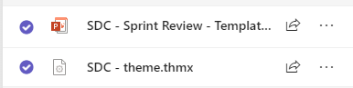

Or downloand directly below. (Require access to SDC Team folder)

[SDC-Theme](https://bcgov.sharepoint.com/:u:/t/00108/Eaa3nnuay4lHuE3_EWGUT2kBJE7X_7QMLYnl2-DZex7xFw?e=Ovaa6Q)

[SDC-Sprint Review-Template](https://bcgov.sharepoint.com/:p:/t/00108/EVnDDtpJgqFAgQlGaZOibxwBDxmEaZkwx_sAqTw-uBSpuQ?e=o0oALI)


### Add theme to your computer
You can add and save the theme in PowerPoint so that you can use it next time. To do so, go to **Design** -> **Themes** and click the downward arrow on
the bottom right corner:

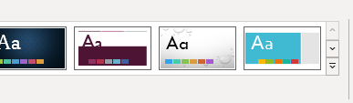

In the dropdown menu, select **Save Current Theme..**

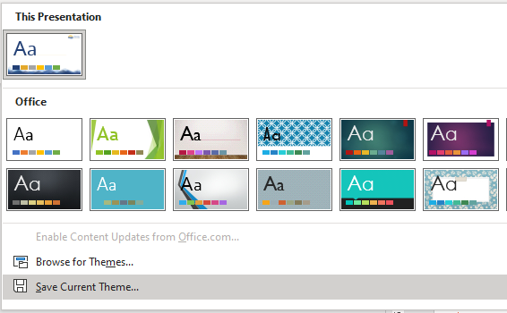

In the pop-up window, give it a memorable name(for example, SDC theme) then click **Save** to save the theme at default location. 

Alternatively, you can save the theme by copying  ***SDC theme.potx*** file to:
```
C:\Users\*your_username*\AppData\Roaming\Microsoft\Templates\Document Themes
```

Once you have done that, you should see your new theme under **Design** -> **Themes** -> **Custom**.

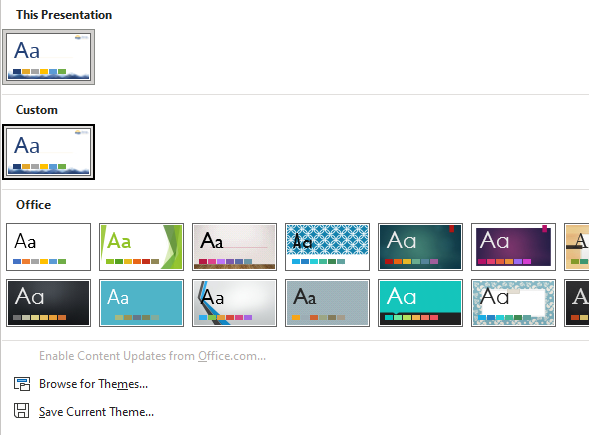


[Back to top][1]

[3]: #table-of-content

---


## Using SDC theme and Sprint Review template


### How to use SDC theme

#### Apply SDC theme to existing slide decks
To apply SDC theme to existing decks, simply go to **Design** -> **Themes**, and select SDC theme under **Custom**.

*Be cautious before applying new themes to an existing deck, as it may result in unanticipated changes to your existing decks.*

#### Create new decks with SDC theme
To create new decks with SDC theme, open PowerPoint app or go to **File** if PowerPoint is already opened:

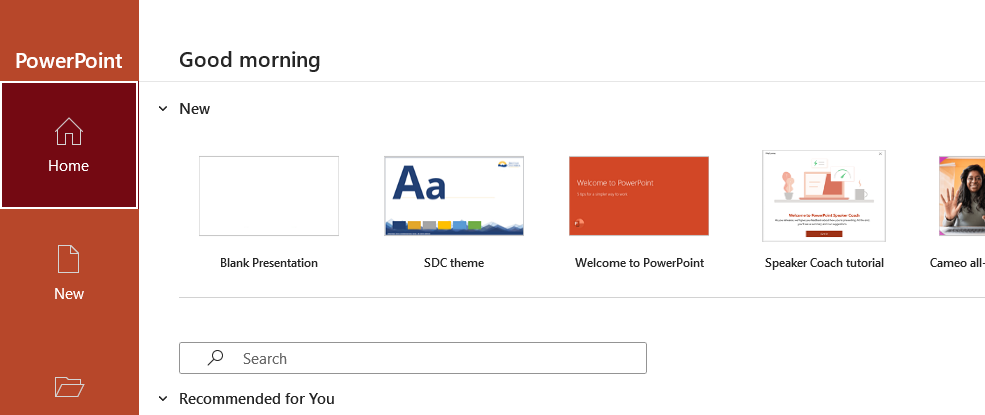

If you have saved the theme in your computer, you should see the SDC theme under **New** section. Clicking it will 
open a pop-up window that shows sample slides of the theme.

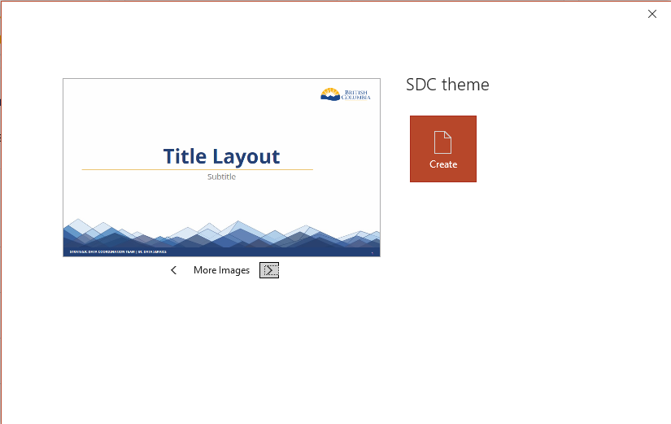

Click **Create** to continue and start creating your new slide deck.

### How to use SDC Sprint Review template
To use the SDC Sprint Review template, simple double-click ***SDC Sprint Review template.potx*** file to open it in PowerPoint.

You cannot edit the template file directly in a browser. Either open the file with the PowerPoint app and save a copy in your
computer or download the file directly and open it in PowerPoint app. See [Troubleshooting #1](#cant-edit-in-a-browser)

Once you have opened it in your computer, you can start populating the deck.


[Back to top][1]


---

## Editing

### Editing SDC theme
*Be cautious before making any changes, as it may affect all slide decks using this theme prior and after*.

To make changes to the theme, go to **View** -> **Master Views** and select **Slide Master**.

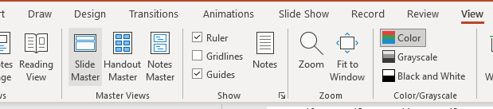

In **Slide Master** screen, you can use a variety of tools to design your theme, including adding new layout, changing colour
scheme and fonts, or insert images. Once you are done, click **Close Master View** to exit.

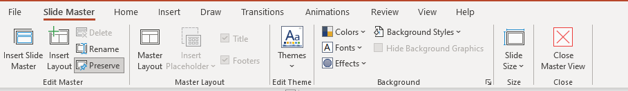

In **Slide Master** screen, you can make changes to

1. *Master* slide which will affect all slides stemed from it, or
1. Individual slides without affecting each other.

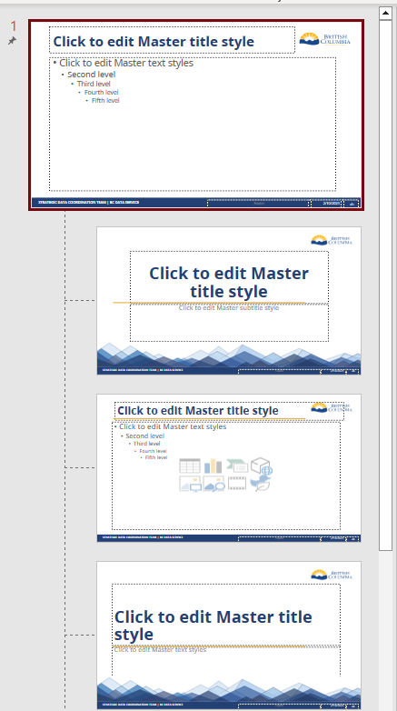

When you finish editing, save it the same way you [add the theme to your computer](#add-theme-to-your-computer), don't forget
to use the same name when you save the theme so that you can find it later.

If you wish to share the new theme or store it in Teams folder, upload the **.potx** file to SDC's Teams folder.

### Editing Sprint Review template

To edit SDC Sprint Review template, open the ***.potx*** file in PowerPoint app, make your changes and save the file. Make sure
you select  to save the file as a template instead of a slide deck. 

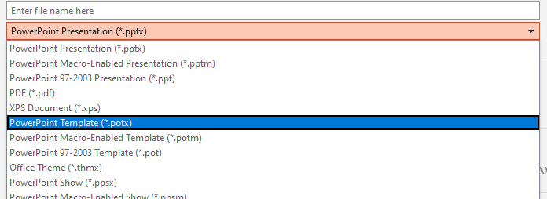

As you cannot edit a template in a browser, you cannot edit the template stored in the Teams folder. To share your new template
with others or to save it for future use, make sure you upload the new template file to Teams folder. You can find the theme file
at:
```
C:\Users\*your_username*\AppData\Roaming\Microsoft\Templates\Document Themes
```


[Back to top][1]


---


## Troubleshooting
### Can't edit in a browser

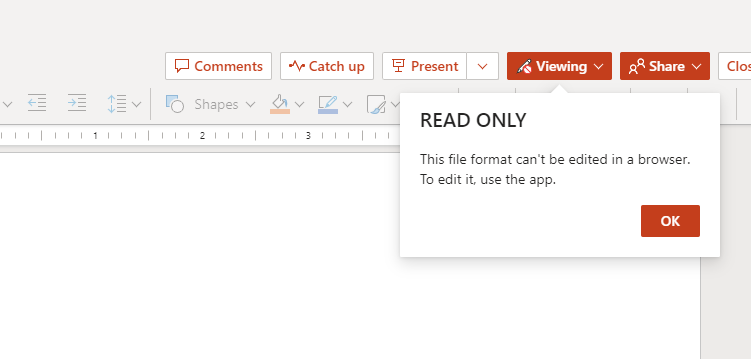
If you try editing in a browser but saw this message and are prevented to make changes in the browser, make sure you are not opening a template file directly. 
You can tell by looking at the suffix of the file. If the file name ends with ***.potx***, you have opened the PowerPoint template file.

Solution: Click **Viewing** and select **Open in Desktop App**.

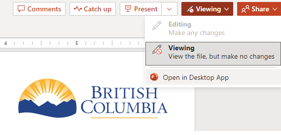

It will open the PowerPoint app in your computer and enable editing. It is recommended to save a copy before you make any changes further at this point.
To do so, go to **File** and select **Save a Copy**. You should not see other save options.

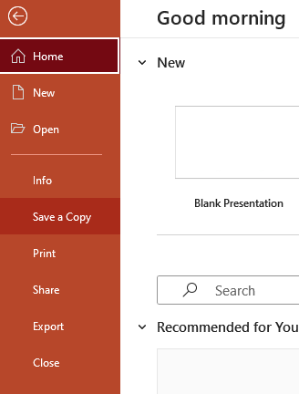

Make sure to select ***.pptx*** (or ***.ppt*** for older verions) in the dropdown menu

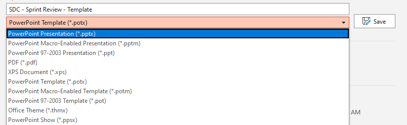

If you have not save a copy before making any changes, you still have to save a copy once you have finished editing.

Once you have saved your slide deck as a ***.pptx*** file, you can upload the file to Teams and edit it in your browser.

[comment]: # (Thank you Jenn and Laurel for reporting to this issue)

### *To Be Added*

[comment]: # (populate this section along the way)

---

## End of Document


[Back to download][1]

[Back to top][3]


[2]: #fantastic-themes-and-where-to-find-them

[1]: #How-to-use-SDC-Theme-and-SDC-Sprint-Review-Template